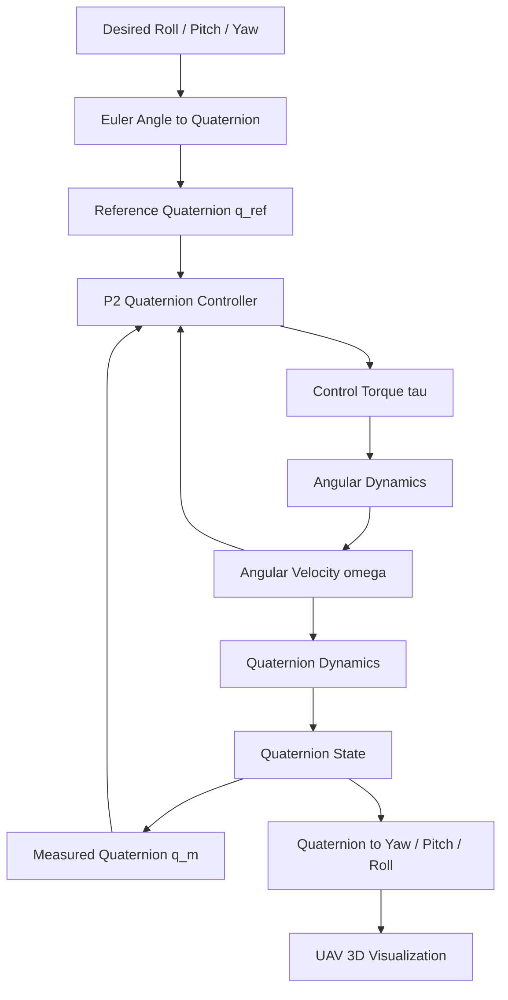

<p align="center">
  
</p>

# Full Quaternion-Based Attitude Control of a Quadrotor UAV

## Team Members

| S. No. | Name | Roll Number | Email |
|---|---|---|---|
| 1 | Gudivada Geetham Rishi Kanth | cb.sc.u4aie24218 | cb.sc.u4aie24218@cb.students.amrita.edu |
| 2 | Nakka Saampotth Maddileti | cb.sc.u4aie24233 | cb.sc.u4aie24233@cb.students.amrita.edu |
| 3 | Namburi Rupesh | cb.sc.u4aie24234 | cb.sc.u4aie24234@cb.students.amrita.edu |
| 4 | Telapolu Bala Prasanna Kumar | cb.sc.u4aie24256 | cb.sc.u4aie24256@cb.students.amrita.edu |
| 5 | Uday Sri Yaramati | cb.sc.u4aie24260 | cb.sc.u4aie24260@cb.students.amrita.edu |

## Abstract

This project focuses on the development of a quaternion-based attitude control system for a quadrotor UAV. The project explores the use of quaternions for representing the UAV's orientation and developing an attitude control approach for roll, pitch, and yaw motion. The control system is being developed using MATLAB/Simulink and MuJoCo, providing simulation environments for studying the quadrotor's attitude dynamics and controller response.

The project is based on the quaternion-based attitude control approach presented in the selected base paper, with emphasis on quaternion representation, attitude error calculation, and controller development. The current work focuses on developing and validating the simulation models and integrating the attitude control framework across the simulation environments.

# Introduction

Unmanned Aerial Vehicles (UAVs), particularly quadrotors with Vertical Take-Off and Landing (VTOL) capability, have gained significant attention because of their ability to perform complex aerial missions. Quadrotor control is generally divided into translation control and attitude control, where the position controller can generate desired attitude set-points for the attitude controller. Achieving accurate, smooth, and robust attitude stabilization remains an important challenge in quadrotor control.

The attitude of a quadrotor is described by its roll, pitch, and yaw rotations. A major challenge in attitude control arises from the mathematical properties of three-dimensional rotations, since finite rotations are non-commutative and cannot be treated as ordinary vectors. Conventional approaches based on Euler angles are intuitive but suffer from singularities, particularly the well-known gimbal-lock problem. Direction Cosine Matrices (DCMs) avoid this singularity but introduce a more complex representation and require maintaining orthogonality constraints.

To overcome these limitations, the base paper, **“Full Quaternion Based Attitude Control for a Quadrotor” by Emil Fresk and George Nikolakopoulos**, proposes the use of quaternions for representing quadrotor attitude. A quaternion provides a compact four-parameter representation of three-dimensional orientation while avoiding the geometric singularities associated with Euler angles. The paper's key approach is to implement both the quadrotor attitude model and the nonlinear Proportional Squared (P2) controller directly in quaternion space, without requiring transformations through Euler angles or DCMs.

A unit quaternion can be represented as

$$
q =
\begin{bmatrix}
q_w\\
q_x\\
q_y\\
q_z
\end{bmatrix},
$$

with the unit-norm constraint

$$
q_w^2+q_x^2+q_y^2+q_z^2=1.
$$

Quaternions can therefore be used to represent the UAV's orientation and calculate attitude errors directly in quaternion space. Euler angles can still be used at the input or visualization level, allowing intuitive roll, pitch, and yaw commands to be converted into quaternion references.

The proposed project follows this quaternion-based control philosophy and develops a simulation framework using MATLAB/Simulink and MuJoCo. The implementation focuses on quaternion attitude representation, quaternion reference generation, attitude-error calculation, P2 controller development, quadrotor rotational dynamics, and quaternion kinematics. The simulated attitude is also visualized to observe the UAV's response to desired roll, pitch, and yaw commands.

# Methodology

## 1. Overall Methodology

The project follows the quaternion-space attitude-control methodology presented in the base paper and implements the control loop in simulation. The main stages are:

1. Define the desired roll, pitch, and yaw attitude.
2. Convert the desired attitude into a reference quaternion $q_{ref}$.
3. Obtain the measured quaternion $q_m$ from the simulated UAV attitude.
4. Calculate the quaternion attitude error.
5. Extract the vector part of the quaternion error as the attitude-axis error.
6. Use the P2 controller together with angular velocity feedback to calculate the control torque $\tau$.
7. Apply the torque to the quadrotor rotational dynamics.
8. Propagate angular velocity into quaternion dynamics.
9. Obtain the updated quaternion state.
10. Feed the measured attitude back to the controller.
11. Convert the quaternion to yaw, pitch, and roll when required for visualization and analysis.
12. Evaluate the UAV response using MATLAB/Simulink and MuJoCo.

## 2. Methodology Flow Diagram



The controller forms the feedback loop using the measured quaternion and angular velocity. The quaternion state is continuously updated through the rotational dynamics and quaternion kinematics.

## 3. Quaternion Mathematical Formulation

### 3.1 Quaternion Representation

The project uses the **scalar-first** quaternion convention:

$$
q =
\begin{bmatrix}
q_w\\
q_x\\
q_y\\
q_z
\end{bmatrix}
$$

where $q_w$ is the scalar part and $(q_x,q_y,q_z)$ is the vector part.

For a valid attitude representation, the quaternion must satisfy

$$
\|q\| = \sqrt{q_w^2+q_x^2+q_y^2+q_z^2}=1.
$$

### 3.2 Quaternion Multiplication

For two scalar-first quaternions

$$
p=
\begin{bmatrix}
p_w \\
p_x \\
p_y \\
p_z \
end{bmatrix},
\qquad
q=
\begin{bmatrix}
q_w \\ 
q_x \\
q_y \\
q_z \
end{bmatrix},
$$

the quaternion product is

$$
p\otimes q =
\begin{bmatrix}
 p_wq_w-p_xq_x-p_yq_y-p_zq_z\\
 p_wq_x+p_xq_w+p_yq_z-p_zq_y\\
 p_wq_y-p_xq_z+p_yq_w+p_zq_x\\
 p_wq_z+p_xq_y-p_yq_x+p_zq_w
\end{bmatrix}.
$$

Quaternion multiplication is non-commutative, consistent with three-dimensional rotations.

### 3.3 Quaternion Conjugate and Inverse

The conjugate of a scalar-first quaternion is

$$
q^*=
\begin{bmatrix}
q_w\\
-q_x\\
-q_y\\
-q_z
\end{bmatrix}.
$$

For a unit quaternion,

$$
q^{-1}=q^*.
$$

## 4. Reference Attitude Generation

The desired roll $\phi$, pitch $\theta$, and yaw $\psi$ are converted into a reference quaternion using the **ZYX (yaw-pitch-roll) convention**.

$$
q_{ref} =
\begin{bmatrix}
q_w \\
q_x \\
q_y \\
q_z
\end{bmatrix}
$$

The quaternion components are

$$
\begin{aligned}
q_w &= \cos\frac{\phi}{2}\cos\frac{\theta}{2}\cos\frac{\psi}{2}
+\sin\frac{\phi}{2}\sin\frac{\theta}{2}\sin\frac{\psi}{2},\\
q_x &= \sin\frac{\phi}{2}\cos\frac{\theta}{2}\cos\frac{\psi}{2}
-\cos\frac{\phi}{2}\sin\frac{\theta}{2}\sin\frac{\psi}{2},\\
q_y &= \cos\frac{\phi}{2}\sin\frac{\theta}{2}\cos\frac{\psi}{2}
+\sin\frac{\phi}{2}\cos\frac{\theta}{2}\sin\frac{\psi}{2},\\
q_z &= \cos\frac{\phi}{2}\cos\frac{\theta}{2}\sin\frac{\psi}{2}
-\sin\frac{\phi}{2}\sin\frac{\theta}{2}\cos\frac{\psi}{2}.
\end{aligned}
$$

### 4.1 Example: 90-Degree Roll

For a pure 90-degree roll command, $\theta=0$ and $\psi=0$. Therefore,

$$
q_{ref}=\begin{bmatrix}
\cos(\pi/4)\\
\sin(\pi/4)\\
0\\
0
\end{bmatrix}
\approx
\begin{bmatrix}
0.7071\\
0.7071\\
0\\
0
\end{bmatrix}.
$$

This quaternion represents the desired 90-degree rotation about the roll axis.

## 5. Quaternion Attitude Error

The measured attitude is $q_m$. For the scalar-first convention, the inverse of the measured unit quaternion is

$$
q_m^{-1}=q_m^*=\begin{bmatrix}
q_{mw}\\
-q_{mx}\\
-q_{my}\\
-q_{mz}
\end{bmatrix}.
$$

The attitude-error quaternion is

$$
q_{err}=q_{ref}\otimes q_m^*.
$$

Writing

$$
q_{err}=\begin{bmatrix}
q_{err,w}\\
q_{err,x}\\
q_{err,y}\\
q_{err,z}
\end{bmatrix},
$$

its vector part is

$$
q_{err,v}=\begin{bmatrix}
q_{err,x}\\
q_{err,y}\\
q_{err,z}
\end{bmatrix}.
$$

This vector part is used as the attitude-axis error by the P2 controller.

## 6. Quadrotor Rotational Dynamics

The base paper uses the rigid-body rotational dynamics

$$
I\dot{\omega}=\tau-\omega\times(I\omega),
$$

or

$$
\dot{\omega}=I^{-1}\tau-I^{-1}\left[\omega\times(I\omega)\right].
$$

where $I$ is the inertia matrix, $\omega=[\omega_x,\omega_y,\omega_z]^T$ is body angular velocity, and $\tau=[\tau_x,\tau_y,\tau_z]^T$ is control torque.

### Current Simulation Model

The current MATLAB/Simulink model initially uses the simplified rotational dynamics

$$
I\dot{\omega}=\tau
$$

and therefore

$$
\dot{\omega}=I^{-1}\tau.
$$

The current inertia matrix is

$$
I=\begin{bmatrix}
1.4\times10^{-5}&0&0\\
0&1.4\times10^{-5}&0\\
0&0&2.2\times10^{-5}
\end{bmatrix}.
$$

The full nonlinear gyroscopic term from the base-paper model can be incorporated as the simulation is further developed.

## 7. Quaternion Kinematics

For the adopted scalar-first quaternion convention and body-frame angular velocity, the quaternion kinematics are written as

$$
\dot q=\frac{1}{2}
\begin{bmatrix}
0 & -\omega_x & -\omega_y & -\omega_z\\
\omega_x & 0 & \omega_z & -\omega_y\\
\omega_y & -\omega_z & 0 & \omega_x\\
\omega_z & \omega_y & -\omega_x & 0
\end{bmatrix}q.
$$

Equivalently,

$$
\dot q=\frac{1}{2}\,q\otimes
\begin{bmatrix}0\\\omega_x\\\omega_y\\\omega_z\end{bmatrix}
$$

for the adopted multiplication/order convention.

The project propagates the quaternion state using the simulated angular velocity. The initial attitude is

$$
q(0)=\begin{bmatrix}1\\0\\0\\0\end{bmatrix}.
$$

## 8. P2 Quaternion Controller

The nonlinear P2 controller proposed in the base paper combines quaternion attitude-error feedback with angular-velocity feedback:

$$
\tau=-P_q q_{err,v}-P_\omega\omega.
$$

Expanding the vector terms,

$$
\tau=-P_q
\begin{bmatrix}
q_{err,x}\\
q_{err,y}\\
q_{err,z}
\end{bmatrix}
-P_\omega
\begin{bmatrix}
\omega_x\\
\omega_y\\
\omega_z
\end{bmatrix}.
$$

where $P_q$ is the quaternion-error gain and $P_\omega$ is the angular-rate feedback gain. The controller operates directly on the quaternion error and angular velocity.

### Current Controller Parameters

The current MATLAB Function implementation follows the same control structure:

```matlab
% Scalar-first quaternion convention: [qw; qx; qy; qz]
q_m_inv = [q_m(1); -q_m(2); -q_m(3); -q_m(4)];
q_error = quatMultiply(q_ref, q_m_inv);
q_error_vec = q_error(2:4);
tau = -Pq*q_error_vec - Pomega*omega;
```

Current simulation gains:

$$
P_q=1.0,\qquad P_\omega=0.1.
$$

These gains are simulation parameters and may be tuned further during the project.

## 9. Feedback and Simulation Environments

The measured quaternion and angular velocity are fed back to the P2 controller, forming a closed-loop attitude-control system.

### MATLAB/Simulink

The Simulink model contains quaternion reference generation, the P2 controller, angular dynamics, quaternion dynamics, state integration, quaternion-to-Euler conversion, and 3D UAV visualization using UAV Toolbox.

### MuJoCo

MuJoCo is being used as an additional physics-based simulation environment for studying the same quadrotor attitude-control problem and evaluating the quaternion-based control approach.

## 10. Methodology Summary

The complete methodology can be summarized as

$$
(\phi_{ref},\theta_{ref},\psi_{ref})
\rightarrow q_{ref}
\rightarrow q_{err}
\rightarrow \tau
\rightarrow \dot{\omega}
\rightarrow \omega
\rightarrow \dot q
\rightarrow q_m.
$$

The measured states are continuously fed back to the P2 controller. This follows the central quaternion-space methodology of the base paper while extending the implementation into MATLAB/Simulink and MuJoCo simulation environments.

# Results

*Results will be added after the simulation and evaluation phase is completed. This section will include Scope plots, quaternion responses, roll/pitch/yaw tracking results, control torque responses, 3D UAV screenshots/recordings, and MuJoCo simulation results.*

# Conclusion

*The final conclusion will be added after completion of the simulation and performance analysis.*

# References

1. E. Fresk and G. Nikolakopoulos, **“Full Quaternion Based Attitude Control for a Quadrotor,”** European Control Conference (ECC), 2013. **Base Paper.**
2. T. Bresciani, **“Modelling, Identification and Control of a Quadrotor Helicopter,”** Ph.D. dissertation, Lund University, 2008.
3. R. Mahony, V. Kumar, and P. Corke, **“Multirotor Aerial Vehicles: Modeling, Estimation, and Control of Quadrotor,”** IEEE Robotics & Automation Magazine, 2012.
4. J. B. Kuipers, **Quaternions and Rotation Sequences**, Princeton University Press, 1998.
5. J. Diebel, **“Representing Attitude: Euler Angles, Unit Quaternions, and Rotation Vectors,”** 2006.
6. MathWorks, **UAV Toolbox Documentation:** https://www.mathworks.com/help/uav/
7. MathWorks, **Simulink Documentation:** https://www.mathworks.com/help/simulink/
8. MuJoCo Documentation: https://mujoco.readthedocs.io/
